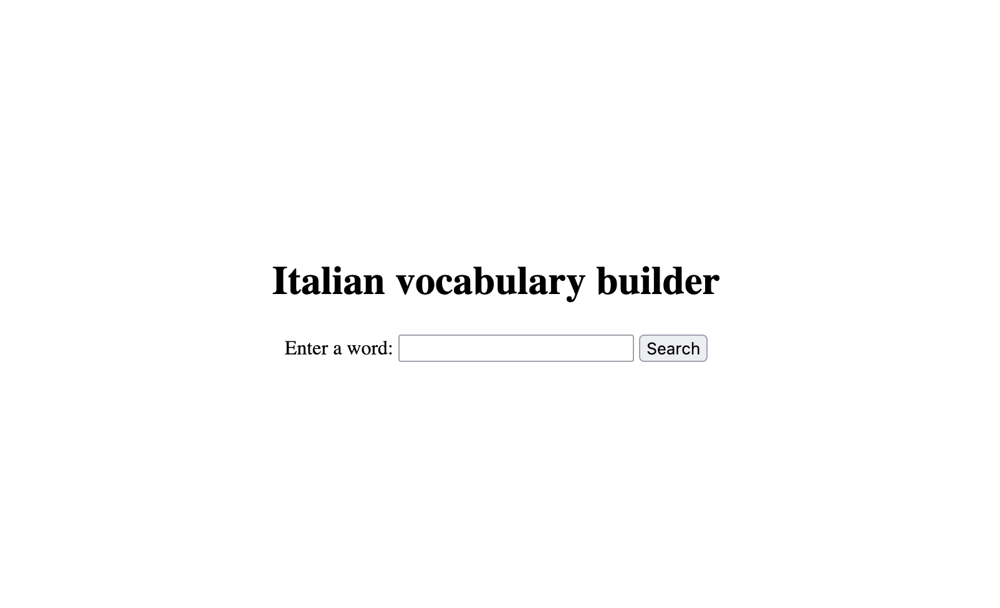
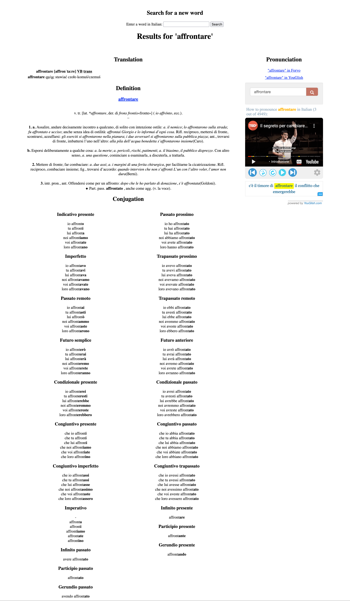

# Italian vocabulary builder 🇮🇹

A combined interface for Treccani, PONS, Reverso and Coniugazione.it. Translate
a word, get its definition and exemplary
sentences in one call.



### Motivation 👩🏻‍🎓

When studying Italian and learning new vocabulary, for each word, I find myself
repeating the same exact steps over and over again:

* checking its translation to Polish and/or English,
* searching for its definition, synonyms and exemplary sentences in Treccani,
* listening to the proper pronunciation,
* looking up its conjugation.

To speed up this process, I decided to write a bit of Python code, so that I
have to only type a word once,
without manually visiting multiple websites.

> **This app is intended only for personal, private use.**



## Sources

### [Treccani](https://www.treccani.it/)

This interface uses two functions from Treccani:

* [Vocabolario](https://www.treccani.it/vocabolario/)
* (to be added) [Sinonimi](https://www.treccani.it/sinonimi/)

### [Reverso](https://context.reverso.net/)

> ⚠️ From my experience, using Reverso through the `reverso_context_api` client
> often leads to having your IP address
> temporarily banned.
> Use with caution.

### [PONS](https://en.pons.com/)

I use
[Pons Online Dictionary API](https://en.pons.com/p/online-dictionary/developers/api)
for translations.
The POD-API is provided to you directly with a free quota of 1,000 reference
queries per month.

**Once you obtain the POD-API secret, place it in the `.credentials` file
generated based on `.credentials.template`.**

[API Documentation](https://pl.pons.com/p/files/uploads/pons/api/api-documentation.pdf)

You can look up available
dictionaries [here](https://api.pons.com/v1/dictionaries?language=en).

### [YouGlish](https://youglish.com/italian)

> **Tip:**
>
> Try changing the initial input with one of the conjugated versions for more
> examples, e.g. change `fare` to `faccia` or `facesse`.

The free YouGlish plan allows up to 20 requests per day using this widget.
Once this quota is exceeded, you can either purchase the premium plan
or used the generated link to visit YouGlish in a new private/incognito tab.

### [Coniugazione.it](https://www.coniugazione.it/)

Coniugazione.it is used to provide conjugation tables (for verbs only).

### [Forvo](https://forvo.com/)

The results page contains a link to Forvo, so you can look up recordings with
the correct pronunciation of searched words.

## Running the app

### Dev environment setup

* Python version: `3.13.3`
* Set up with `uv` (if not already installed,
  see [uv docs](https://docs.astral.sh/uv/getting-started/installation/)).
* Run `make install` to install all dependencies. This should create a
  virtual environment in the `.venv` directory.
  * If you wish to do development, you can use `make install-dev` to install
    development dependencies as well.
* You can reactivate the virtual environment with

```bash
source .venv/bin/activate
```

### Run Flask

```bash
flask run
```

> `(...)`
>
> `* Running on http://127.0.0.1:5000`

#### Debug mode

When running the app in debug mode with

```bash
flask run --debug
```

some functionalities might change, such as:

* YouGlish widget will not be displayed in order
  to save the free daily quota,
* results will not be cached.
